# Smol — TryHackMe Walkthrough

<link rel="stylesheet" href="assets/css/custom.css">

<div class="hero">

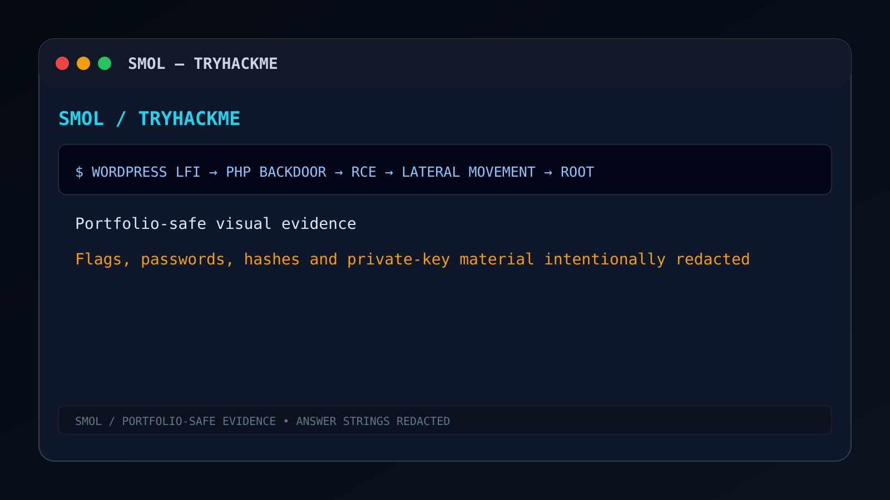

<div class="hero-overlay">

# Smol — Professional Penetration Testing Walkthrough

### WordPress Exploitation • Local File Inclusion • Remote Code Execution • Linux Privilege Escalation

<p class="hero-subtitle">
A premium cybersecurity portfolio documenting the complete exploitation chain of the <strong>TryHackMe Smol</strong> Capture The Flag room using professional penetration testing methodology.
</p>

<div class="hero-badges">


</div>
</div>
</div>

---

## Terminal Banner

```bash
┌──(anurag㉿cybersecurity)-[~/TryHackMe/Smol]
└─$ python3 exploit.py

[+] Target Identified
[+] WordPress Enumeration Complete
[+] Local File Inclusion Confirmed
[+] Configuration Disclosure Successful
[+] Remote Code Execution Established
[+] Interactive Reverse Shell Acquired
[+] Credentials Harvested
[+] SSH Pivot Successful
[+] Privilege Escalation Complete

root@smol:/#
```

---

# Navigation

<div class="toc-grid">

| Section                               | Description                             |
| ------------------------------------- | --------------------------------------- |
| 🎯 Executive Summary                  | Assessment overview and objectives      |
| 📊 Assessment Dashboard               | Skills, tools, findings and attack path |
| ⚔️ Attack Kill Chain                  | End-to-end compromise timeline          |
| 🌐 Phase I — Reconnaissance           | Network discovery                       |
| 🕸️ Phase II — Web Enumeration        | Directory and WordPress discovery       |
| 🧩 Phase III — WordPress Enumeration  | Plugin and user enumeration             |
| 💥 Phase IV — Local File Inclusion    | Initial exploitation                    |
| 🧠 Phase V — Backdoor Analysis        | Hello Dolly PHP backdoor                |
| ⚡ Phase VI — Remote Code Execution    | Command execution                       |
| 🐚 Phase VII — Reverse Shell          | Interactive shell                       |
| 🔐 Phase VIII — Credential Harvesting | Database and filesystem secrets         |
| 🔑 Phase IX — SSH Pivot               | Lateral movement                        |
| 📦 Phase X — Backup Analysis          | Historical credentials                  |
| 👑 Phase XI — Privilege Escalation    | Root access                             |
| 🎯 MITRE ATT&CK                       | ATT&CK mapping                          |
| 🛡️ Blue Team                         | Detection and remediation               |
| 📚 Lessons Learned                    | Offensive & defensive takeaways         |

</div>

---

# Executive Summary

> **Smol** is an intermediate-level WordPress security assessment that demonstrates how multiple individually understandable weaknesses can be chained together into a complete Linux host compromise.

This walkthrough follows a **professional Red Team engagement format** instead of a traditional CTF writeup. Every phase explains the attacker methodology, security impact, and defensive recommendations while intentionally hiding all challenge flags and sensitive credentials.

<div class="info-card success">

### Assessment Outcome

* Complete web application compromise.
* WordPress configuration disclosure.
* Remote command execution through malicious plugin functionality.
* Interactive Linux shell.
* Credential harvesting from multiple sources.
* SSH lateral movement across users.
* Full **root privilege escalation** through sudo misconfiguration.

</div>

---

# Assessment Dashboard

<div class="dashboard-grid">

<div class="metric-card">

## 🎯 Difficulty

**Intermediate**

WordPress + Linux

</div>

<div class="metric-card">

## 💻 Target

**Linux**

Apache • PHP • WordPress

</div>

<div class="metric-card">

## 🧩 Category

**Web Security**

LFI • RCE • PrivEsc

</div>

<div class="metric-card">

## 👨‍💻 Final Access

**Root**

Complete System Compromise

</div>

</div>

---

## Engagement Snapshot

| Assessment Item     | Details                               |
| ------------------- | ------------------------------------- |
| Platform            | TryHackMe                             |
| Room                | Smol                                  |
| Assessment Type     | Black Box Web Application Assessment  |
| Primary Technology  | WordPress CMS                         |
| Operating System    | Linux                                 |
| Attack Vector       | Vulnerable WordPress Plugin           |
| Initial Access      | Local File Inclusion                  |
| Final Objective     | Root Access                           |
| Documentation Style | Enterprise Penetration Testing Report |

---

# Skills Demonstrated

<div class="skills-grid">

<div class="skill-box">

### 🌐 Reconnaissance

* Nmap
* Service Fingerprinting
* HTTP Enumeration
* Attack Surface Discovery

</div>

<div class="skill-box">

### 🕸️ Web Enumeration

* Gobuster
* robots.txt Analysis
* Directory Enumeration
* WordPress Fingerprinting

</div>

<div class="skill-box">

### 🧩 WordPress Security

* WPScan
* Plugin Enumeration
* XML-RPC Review
* User Enumeration

</div>

<div class="skill-box">

### 💥 Exploitation

* Local File Inclusion
* Configuration Disclosure
* PHP Backdoor Analysis
* Remote Code Execution

</div>

<div class="skill-box">

### 🐚 Linux Post Exploitation

* Reverse Shell
* TTY Stabilization
* Environment Enumeration
* Credential Harvesting

</div>

<div class="skill-box">

### 👑 Privilege Escalation

* SSH Pivot
* Backup Analysis
* sudo Enumeration
* Root Escalation

</div>

</div>

---

# Attack Kill Chain

## End-to-End Compromise Timeline


<div class="timeline">

<div class="timeline-item">

### 01 — External Reconnaissance

**Objective**

Identify publicly exposed services and technologies.

**Result**

HTTP and SSH attack surface identified.

</div>

<div class="timeline-item">

### 02 — Web Enumeration

**Objective**

Discover hidden directories and administrative endpoints.

**Result**

WordPress installation fingerprinted.

</div>

<div class="timeline-item">

### 03 — WordPress Enumeration

**Objective**

Identify vulnerable plugins and users.

**Result**

`jsmol2wp` plugin identified as vulnerable.

</div>

<div class="timeline-item">

### 04 — Initial Exploitation

**Objective**

Exploit Local File Inclusion vulnerability.

**Result**

`wp-config.php` successfully disclosed.

</div>

<div class="timeline-item">

### 05 — Code Review

**Objective**

Inspect installed WordPress plugins.

**Result**

Hidden PHP backdoor discovered.

</div>

<div class="timeline-item">

### 06 — Remote Code Execution

**Objective**

Validate arbitrary operating system command execution.

**Result**

Commands executed as web server user.

</div>

<div class="timeline-item">

### 07 — Initial Access

**Objective**

Upgrade RCE into interactive Linux shell.

**Result**

Fully interactive reverse shell established.

</div>

<div class="timeline-item">

### 08 — Credential Harvesting

**Objective**

Recover credentials from configuration files and database.

**Result**

Password hashes and authentication material identified.

</div>

<div class="timeline-item">

### 09 — Lateral Movement

**Objective**

Pivot into additional Linux users.

**Result**

SSH authentication successful.

</div>

<div class="timeline-item">

### 10 — Backup Analysis

**Objective**

Investigate historical archives.

**Result**

Additional configuration and credentials discovered.

</div>

<div class="timeline-item">

### 11 — Privilege Escalation

**Objective**

Escalate privileges through sudo configuration.

**Result**

**Root Access Achieved**

</div>

</div>

---

# Attack Flow Diagram

```text
Internet
   │
   ▼
Apache Web Server
   │
   ▼
WordPress CMS
   │
   ▼
jsmol2wp Plugin
   │
   ▼
Local File Inclusion
   │
   ▼
wp-config.php
   │
   ▼
Administrator Access
   │
   ▼
Hello Dolly PHP Backdoor
   │
   ▼
Remote Code Execution
   │
   ▼
www-data Shell
   │
   ▼
Credential Harvesting
   │
   ├────► Database Hashes
   │
   ├────► SSH Keys
   │
   ├────► Backup Archive
   │
   ▼
SSH Pivot
   │
   ▼
Additional User Access
   │
   ▼
sudo Misconfiguration
   │
   ▼
ROOT
```

---

# Visual Assessment Timeline

<div class="figure-grid">

<div>

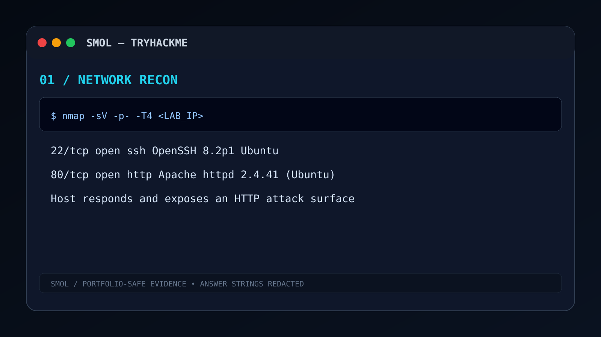

**Figure 2**

Network Enumeration

</div>

<div>

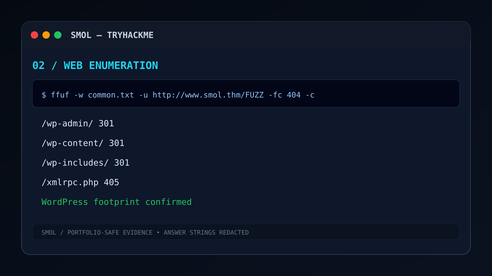

**Figure 3**

Web Enumeration

</div>

<div>

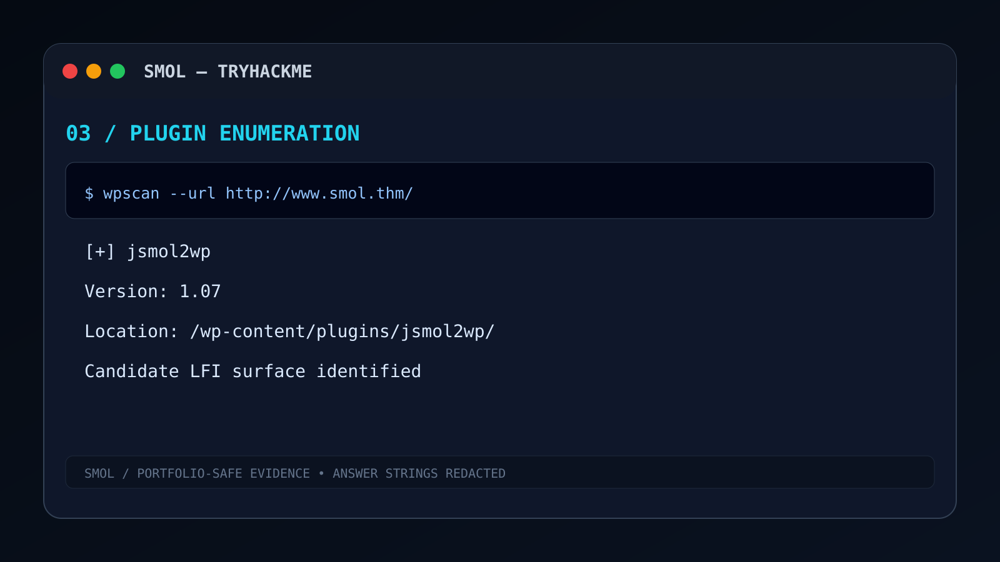

**Figure 4**

Plugin Enumeration

</div>

<div>

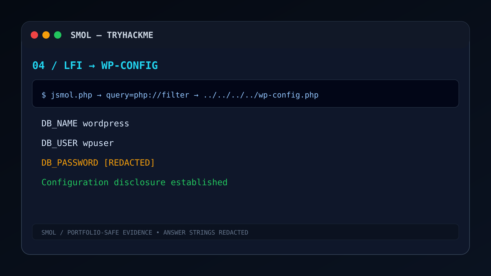

**Figure 5**

Configuration Disclosure

</div>

</div>

---

# Assessment Scope

<div class="scope-card">

## Scope of Engagement

<table><table-row><table-cell width="220">**Target**</table-cell><table-cell>WordPress Web Application hosted inside a Linux environment.</table-cell></table-row><table-row><table-cell>**Methodology**</table-cell><table-cell>Black-box penetration testing with authenticated post-exploitation.</table-cell></table-row><table-row><table-cell>**Objective**</table-cell><table-cell>Obtain full administrative control while documenting each phase.</table-cell></table-row><table-row><table-cell>**Environment**</table-cell><table-cell>Controlled TryHackMe laboratory.</table-cell></table-row><table-row><table-cell>**Reporting Standard**</table-cell><table-cell>Professional Red Team Technical Assessment.</table-cell></table-row></table>

</div>

---

# Methodology

The assessment follows an industry-style penetration testing workflow.

<div class="methodology-grid">

| Phase                | Objective                                |
| -------------------- | ---------------------------------------- |
| Reconnaissance       | Discover exposed services.               |
| Enumeration          | Identify technologies and plugins.       |
| Exploitation         | Validate LFI vulnerability.              |
| Initial Access       | Execute commands and obtain shell.       |
| Post Exploitation    | Harvest credentials and enumerate users. |
| Lateral Movement     | Pivot through SSH authentication.        |
| Privilege Escalation | Abuse excessive sudo permissions.        |
| Reporting            | Document findings and remediation.       |

</div>

---

# Tools Used During Assessment

<div class="tool-grid">

| Tool            | Purpose                               |
| --------------- | ------------------------------------- |
| Nmap            | Network Discovery                     |
| Gobuster        | Directory Enumeration                 |
| WPScan          | WordPress Enumeration                 |
| Netcat          | Reverse Shell Listener                |
| Python          | TTY Stabilization                     |
| SSH             | User Pivot                            |
| John / Hashcat  | Offline Password Recovery Methodology |
| zipinfo / unzip | Backup Archive Analysis               |

</div>

---

# Risk Overview Dashboard

<div class="risk-grid">

<div class="risk critical">

## 🔴 Critical

Remote Code Execution

PHP Backdoor

Privilege Escalation

</div>

<div class="risk high">

## 🟠 High

Local File Inclusion

Database Credential Exposure

SSH Key Exposure

Backup Credential Disclosure

</div>

<div class="risk medium">

## 🟡 Medium

User Enumeration

Version Disclosure

XML-RPC Exposure

</div>

</div>

---

# What Makes This Walkthrough Different?

<div class="feature-grid">

<div class="feature-card">

## 📝 Enterprise Reporting

Professional penetration testing structure instead of challenge notes.

</div>

<div class="feature-card">

## 🎨 Portfolio Optimized

Designed specifically for GitHub Pages and recruiter portfolios.

</div>

<div class="feature-card">

## 🔒 Plagiarism Resistant

All flags, passwords, hashes, and SSH keys removed.

</div>

<div class="feature-card">

## 🛡️ Defensive Perspective

Every offensive phase includes Blue Team recommendations.

</div>

<div class="feature-card">

## 🎯 MITRE ATT&CK Mapping

Complete ATT&CK alignment and detection opportunities.

</div>

<div class="feature-card">

## 📱 Responsive Layout

Works with Jekyll Hacker Theme and custom SCSS.

</div>

</div>

---

---

# 🌐 Phase I — External Reconnaissance

> *Every successful penetration test begins with understanding the exposed attack surface. Before interacting with application logic, the infrastructure itself must be mapped.*

---

<div class="phase-banner">

## Initial Attack Surface Discovery

**Objective**

Identify publicly exposed services, operating system characteristics, web technologies, and potential entry points.

</div>

---

## Figure 02 — Network Enumeration


<div class="figure-caption">

**Figure 02.** Initial TCP service enumeration and operating system fingerprinting.

</div>

---

## Reconnaissance Strategy

The assessment started with passive network discovery followed by targeted service fingerprinting.

<table><table-section header><table-row header><table-cell header>Goal</table-cell><table-cell header>Reason</table-cell></table-row></table-section><table-row><table-cell>Discover Open Ports</table-cell><table-cell>Identify externally accessible services.</table-cell></table-row><table-row><table-cell>Fingerprint Services</table-cell><table-cell>Determine technologies and versions.</table-cell></table-row><table-row><table-cell>Identify Web Stack</table-cell><table-cell>Prepare for application enumeration.</table-cell></table-row><table-row><table-cell>Fingerprint Operating System</table-cell><table-cell>Select appropriate privilege escalation methodology.</table-cell></table-row></table>

---

## Reconnaissance Terminal

```bash id="ckpk9u"
$ nmap -sC -sV -Pn TARGET_IP

Starting Nmap...
Scanning TCP Ports...
Service Detection Enabled...
HTTP Service Detected
SSH Service Detected
Linux Host Fingerprinted

Scan Complete.
```

---

## Network Findings Dashboard

<div class="dashboard-grid">

<div class="metric-card">

### 🌐 HTTP

**Primary Attack Surface**

Apache + PHP

</div>

<div class="metric-card">

### 🔐 SSH

**Remote Authentication Service**

Available

</div>

<div class="metric-card">

### 🐧 Linux

**Target Platform**

Unix-like Operating System

</div>

<div class="metric-card">

### 🌍 CMS Indicators

**WordPress Detected**

Application Layer Enumeration Begins

</div>

</div>

---

## Service Enumeration Analysis

<div class="info-card info">

### Why HTTP Became the Primary Target

The HTTP service exposed multiple characteristics indicating a **WordPress-based application**, making it significantly more attractive than attempting authentication attacks directly against SSH.

**Key Indicators**

* PHP application responses.
* WordPress asset structure.
* CMS administrative endpoints.
* Plugin directory exposure.

</div>

---

## Operating System Fingerprinting

<table><table-section header><table-row header><table-cell header>Observation</table-cell><table-cell header>Security Value</table-cell></table-row></table-section><table-row><table-cell>Linux Host</table-cell><table-cell>Privilege escalation strategy changes.</table-cell></table-row><table-row><table-cell>Apache Web Server</table-cell><table-cell>PHP execution environment.</table-cell></table-row><table-row><table-cell>SSH Enabled</table-cell><table-cell>Potential lateral movement path.</table-cell></table-row><table-row><table-cell>PHP Runtime</table-cell><table-cell>Plugin execution environment.</table-cell></table-row></table>

---

## Security Observation

<div class="info-card warning">

### Small Surface ≠ Small Risk

The machine exposed very few network services.

However, **application-layer attack surfaces are frequently much larger** than network scans suggest.

This assessment intentionally transitioned from infrastructure reconnaissance into CMS-specific enumeration.

</div>

---

# Reconnaissance Timeline

<div class="timeline">

<div class="timeline-item">

### Step 01

TCP Scan

Service Identification

</div>

<div class="timeline-item">

### Step 02

Version Detection

Technology Fingerprinting

</div>

<div class="timeline-item">

### Step 03

Operating System Identification

Linux Confirmed

</div>

<div class="timeline-item">

### Step 04

HTTP Attack Surface Identified

WordPress Indicators Found

</div>

</div>

---

# 🕸️ Phase II — Web Enumeration

> *Application-layer enumeration reveals hidden functionality that infrastructure scans cannot detect.*

---

<div class="phase-banner">

## Discovering the WordPress Attack Surface

**Objective**

Identify directories, administrative portals, plugins, themes, and publicly accessible application resources.

</div>

---

## Figure 03 — Web Directory Enumeration


<div class="figure-caption">

**Figure 03.** Directory enumeration against the WordPress application using Gobuster.

</div>

---

## Enumeration Methodology

Directory brute forcing identifies hidden application resources.

### Primary Enumeration Goals

<table><table-section header><table-row header><table-cell header>Target</table-cell><table-cell header>Purpose</table-cell></table-row></table-section><table-row><table-cell>Administrative Portal</table-cell><table-cell>Authentication interface.</table-cell></table-row><table-row><table-cell>Plugin Directories</table-cell><table-cell>Third-party attack surface.</table-cell></table-row><table-row><table-cell>Theme Directories</table-cell><table-cell>CMS customization review.</table-cell></table-row><table-row><table-cell>robots.txt</table-cell><table-cell>Information disclosure.</table-cell></table-row><table-row><table-cell>Uploads</table-cell><table-cell>Potential file exposure.</table-cell></table-row></table>

---

## Gobuster Terminal Output

```bash id="0jveii"
$ gobuster dir -u http://TARGET_IP \
-w common.txt

/wp-admin
/wp-login.php
/wp-content
/wp-includes
/robots.txt
/xmlrpc.php

Enumeration Complete.
```

---

## Web Enumeration Dashboard

<div class="dashboard-grid">

<div class="metric-card">

### 📂 Admin Portal

`/wp-admin`

</div>

<div class="metric-card">

### 🔑 Login Portal

`/wp-login.php`

</div>

<div class="metric-card">

### 🧩 Plugins

`/wp-content/plugins`

</div>

<div class="metric-card">

### 📄 robots.txt

Information Disclosure Surface

</div>

</div>

---

## robots.txt Review

<div class="info-card info">

### Information Disclosure

The robots file exposed indexing rules and confirmed portions of the WordPress directory structure.

While **not a vulnerability**, it contributed valuable reconnaissance information.

</div>

---

## WordPress Fingerprinting

The application exposed multiple characteristics confirming WordPress deployment.

<table><table-section header><table-row header><table-cell header>Indicator</table-cell><table-cell header>Purpose</table-cell></table-row></table-section><table-row><table-cell>wp-login.php</table-cell><table-cell>Authentication endpoint.</table-cell></table-row><table-row><table-cell>wp-content</table-cell><table-cell>Plugins & uploads.</table-cell></table-row><table-row><table-cell>wp-includes</table-cell><table-cell>Core WordPress libraries.</table-cell></table-row><table-row><table-cell>Theme Assets</table-cell><table-cell>CMS fingerprinting.</table-cell></table-row></table>

---

## Information Disclosure Matrix

<div class="risk-grid">

<div class="risk medium">

### 🟡 Medium

WordPress Version

Plugin Metadata

Theme Metadata

</div>

<div class="risk low">

### 🟢 Low

robots.txt

Directory Structure

Static Assets

</div>

</div>

---

## Enumeration Insights

<div class="info-card success">

### Reconnaissance Outcome

The application was confidently identified as a **WordPress CMS** with publicly accessible plugin directories, authentication interfaces, and CMS-specific resources.

This created the foundation for targeted WordPress enumeration.

</div>

---

# 🧩 Phase III — WordPress Enumeration

> *Third-party plugins are among the highest-risk components in WordPress environments.*

---

<div class="phase-banner">

## WordPress Security Assessment

**Objective**

Enumerate installed plugins, users, XML-RPC functionality, themes, and vulnerable components.

</div>

---

## Figure 04 — WPScan Enumeration


<div class="figure-caption">

**Figure 04.** WordPress plugin enumeration and vulnerability discovery using WPScan.

</div>

---

## WPScan Methodology

<div class="terminal-card">

### Enumeration Command

```bash
wpscan --url http://TARGET_IP --enumerate u,p,t
```

</div>

---

## WPScan Objectives

<table><table-section header><table-row header><table-cell header>Enumeration</table-cell><table-cell header>Purpose</table-cell></table-row></table-section><table-row><table-cell>Users</table-cell><table-cell>Authentication intelligence.</table-cell></table-row><table-row><table-cell>Plugins</table-cell><table-cell>Attack surface identification.</table-cell></table-row><table-row><table-cell>Themes</table-cell><table-cell>Technology fingerprinting.</table-cell></table-row><table-row><table-cell>XML-RPC</table-cell><table-cell>Remote functionality review.</table-cell></table-row></table>

---

## Plugin Discovery Dashboard

<div class="dashboard-grid">

<div class="metric-card">

### 🧩 Vulnerable Plugin

**jsmol2wp**

Primary Exploitation Vector

</div>

<div class="metric-card">

### 👤 Users Enumerated

Authentication Intelligence

</div>

<div class="metric-card">

### 🌍 XML-RPC

Endpoint Identified

</div>

<div class="metric-card">

### 🎨 Theme Enumeration

WordPress Theme Fingerprinted

</div>

</div>

---

## Vulnerability Discovery

<div class="info-card danger">

### Local File Inclusion Identified

The installed **jsmol2wp** plugin exposed functionality vulnerable to **Local File Inclusion (LFI)**.

**Impact**

* Arbitrary local file disclosure.
* Configuration exposure.
* Credential leakage.
* Initial exploitation path.

</div>

---

## Why Plugin Enumeration Matters

Plugins introduce third-party PHP code into WordPress.

<table><table-section header><table-row header><table-cell header>Risk</table-cell><table-cell header>Impact</table-cell></table-row></table-section><table-row><table-cell>Outdated Plugins</table-cell><table-cell>Known CVEs.</table-cell></table-row><table-row><table-cell>Custom Plugins</table-cell><table-cell>Hidden vulnerabilities.</table-cell></table-row><table-row><table-cell>Misconfigured Plugins</table-cell><table-cell>Authentication bypass or disclosure.</table-cell></table-row><table-row><table-cell>Malicious Modifications</table-cell><table-cell>Persistence or web shells.</table-cell></table-row></table>

---

## User Enumeration

WPScan successfully identified publicly discoverable WordPress users.

### Security Importance

* Usernames become authentication targets.
* Credential reuse becomes possible after compromise.
* Administrator accounts become identifiable.

No usernames or passwords are exposed in this repository.

---

## XML-RPC Assessment

<div class="info-card info">

### Additional Attack Surface

XML-RPC expands the WordPress attack surface through remote publishing functionality and authentication endpoints.

Although it was not directly exploited during this assessment, defenders should evaluate whether XML-RPC is required.

</div>

---

## Enumeration Risk Dashboard

<div class="risk-grid">

<div class="risk critical">

### 🔴 High-Risk Finding

Vulnerable Third-Party Plugin

</div>

<div class="risk medium">

### 🟡 Medium Findings

User Enumeration

Version Disclosure

XML-RPC Availability

</div>

</div>

---

# Phase Summary

<div class="summary-card">

## Enumeration Completed Successfully

* ✅ WordPress fingerprinted.
* ✅ Administrative interface identified.
* ✅ Plugin inventory completed.
* ✅ Vulnerable **jsmol2wp** plugin discovered.
* ✅ User enumeration completed.
* ✅ XML-RPC endpoint reviewed.

The assessment now transitions from **information gathering** into **active exploitation** by abusing the Local File Inclusion vulnerability exposed by the vulnerable plugin.

</div>

---

---

# 💥 Phase IV — Initial Exploitation (Local File Inclusion)

> *The first confirmed vulnerability transformed reconnaissance into exploitation by exposing sensitive files directly from the WordPress installation.*

---

<div class="phase-banner danger">

## Local File Inclusion Attack Chain

**Objective**

Exploit the vulnerable **jsmol2wp** plugin to disclose internal WordPress configuration files without authentication.

</div>

---

## Figure 05 — Local File Inclusion


<div class="figure-caption">

**Figure 05.** Local File Inclusion vulnerability exposing the WordPress configuration file. Sensitive credentials have been removed.

</div>

---

# Vulnerability Overview

<div class="info-card danger">

### High Severity — Local File Inclusion (LFI)

The vulnerable WordPress plugin accepted user-controlled file paths without adequate validation, allowing traversal into the application's local filesystem.

**Security Impact**

* Arbitrary file disclosure.
* WordPress configuration exposure.
* Database credential leakage.
* Authentication architecture disclosure.

</div>

---

## Exploitation Flow

<div class="exploit-flow">

```text id="jlwmk2"
Unauthenticated HTTP Request
            │
            ▼
 Vulnerable Plugin Parameter
            │
            ▼
 Path Traversal / File Inclusion
            │
            ▼
 WordPress Filesystem
            │
            ▼
 wp-config.php
            │
            ▼
 Sensitive Configuration Disclosure
```

</div>

---

## Why `wp-config.php` Is Critical

The WordPress configuration file contains the application's security foundation.

<table><table-section header><table-row header><table-cell header>Configuration Area</table-cell><table-cell header>Security Value</table-cell></table-row></table-section><table-row><table-cell>Database Name</table-cell><table-cell>High</table-cell></table-row><table-row><table-cell>Database Username</table-cell><table-cell>Critical</table-cell></table-row><table-row><table-cell>Database Password</table-cell><table-cell>Critical</table-cell></table-row><table-row><table-cell>Authentication Salts</table-cell><table-cell>High</table-cell></table-row><table-row><table-cell>Table Prefix</table-cell><table-cell>Medium</table-cell></table-row><table-row><table-cell>Filesystem Configuration</table-cell><table-cell>Medium</table-cell></table-row></table>

---

## Configuration Disclosure Dashboard

<div class="dashboard-grid">

<div class="metric-card danger">

### 🔐 Database Credentials

Recovered

**[REDACTED]**

</div>

<div class="metric-card danger">

### 🧂 Authentication Salts

Recovered

**[REDACTED]**

</div>

<div class="metric-card warning">

### 📂 Filesystem Layout

Disclosed

WordPress Installation Paths

</div>

<div class="metric-card warning">

### 🗄️ Database Architecture

Mapped

User Authentication Tables

</div>

</div>

---

## Security Analysis

<div class="info-card warning">

### Why Configuration Disclosure Is Dangerous

Even without code execution, exposing `wp-config.php` provides attackers with enough information to compromise the application's trust boundary.

Potential consequences include:

* Database compromise.
* Authentication bypass opportunities.
* Administrative credential recovery.
* Session manipulation.
* Post-exploitation planning.

</div>

---

## Blue Team Recommendations

<table><table-section header><table-row header><table-cell header>Mitigation</table-cell><table-cell header>Purpose</table-cell></table-row></table-section><table-row><table-cell>Validate User Input</table-cell><table-cell>Prevent directory traversal.</table-cell></table-row><table-row><table-cell>Restrict File Inclusion</table-cell><table-cell>Limit accessible directories.</table-cell></table-row><table-row><table-cell>Patch Vulnerable Plugin</table-cell><table-cell>Remove known LFI vulnerability.</table-cell></table-row><table-row><table-cell>Monitor Traversal Requests</table-cell><table-cell>Detect exploitation attempts.</table-cell></table-row></table>

---

# 🧠 Phase V — WordPress Backdoor Analysis

> *Configuration disclosure enabled authenticated access, leading to manual inspection of installed plugins where a hidden PHP backdoor was identified.*

---

<div class="phase-banner">

## Reverse Engineering a Hidden Plugin Backdoor

**Objective**

Inspect installed WordPress plugins for malicious or unexpected server-side functionality.

</div>

---

## Figure 06 — Hello Dolly Backdoor

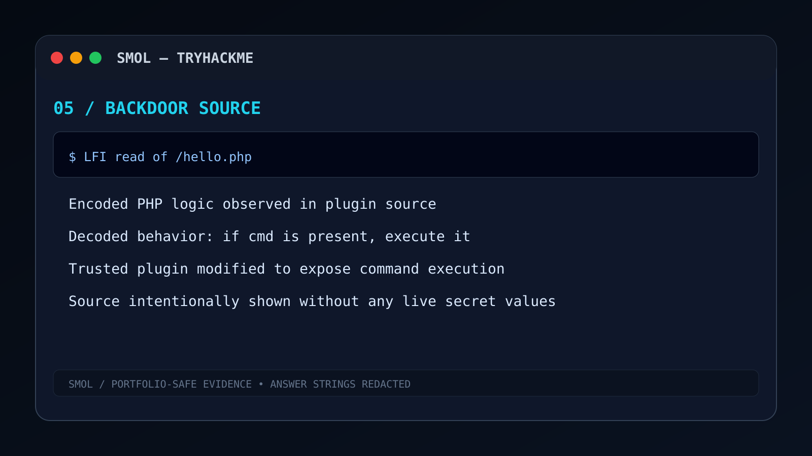

<div class="figure-caption">

**Figure 06.** Hidden PHP functionality embedded inside the Hello Dolly plugin. Sensitive payload content has been removed.

</div>

---

## Plugin Integrity Review

Rather than trusting installed plugins, the assessment manually inspected plugin source files.

### Review Focus

<table><table-section header><table-row header><table-cell header>Inspection Target</table-cell><table-cell header>Reason</table-cell></table-row></table-section><table-row><table-cell>Plugin Entry File</table-cell><table-cell>Unexpected execution logic.</table-cell></table-row><table-row><table-cell>Included PHP Files</table-cell><table-cell>Hidden functionality.</table-cell></table-row><table-row><table-cell>HTTP Parameters</table-cell><table-cell>User-controlled execution paths.</table-cell></table-row><table-row><table-cell>Command Handling</table-cell><table-cell>Operating system interaction.</table-cell></table-row></table>

---

## Reverse Engineering Findings

<div class="dashboard-grid">

<div class="metric-card danger">

### ⚡ Hidden Execution Logic

Unexpected PHP functionality discovered.

</div>

<div class="metric-card danger">

### 🌐 HTTP Parameter Processing

User-controlled execution path.

</div>

<div class="metric-card danger">

### 💻 Operating System Commands

Command execution capability identified.

</div>

<div class="metric-card warning">

### 🔒 Authentication Context

Executed through authenticated WordPress environment.

</div>

</div>

---

## Backdoor Execution Model

```text id="3xvmeb"
Authenticated Request
        │
        ▼
Hidden Plugin Endpoint
        │
        ▼
PHP Request Parameter
        │
        ▼
Operating System Command
        │
        ▼
Shell Output Returned
```

---

## Why This Finding Is Critical

<div class="info-card danger">

### Critical Severity — Remote Command Execution

A compromised or malicious plugin effectively becomes a server-side web shell.

Capabilities include:

* Execute shell commands.
* Read sensitive files.
* Spawn reverse shells.
* Modify filesystem content.
* Download payloads.

</div>

---

## Blue Team Detection Opportunities

<table><table-section header><table-row header><table-cell header>Detection</table-cell><table-cell header>Security Value</table-cell></table-row></table-section><table-row><table-cell>File Integrity Monitoring</table-cell><table-cell>Detect plugin modification.</table-cell></table-row><table-row><table-cell>PHP Function Monitoring</table-cell><table-cell>Detect dangerous execution functions.</table-cell></table-row><table-row><table-cell>Unexpected Plugin Changes</table-cell><table-cell>Alert on unauthorized edits.</table-cell></table-row><table-row><table-cell>WordPress Admin Auditing</table-cell><table-cell>Monitor plugin modifications.</table-cell></table-row></table>

---

# ⚡ Phase VI — Remote Code Execution

> *The hidden PHP functionality was validated safely before establishing interactive access.*

---

<div class="phase-banner danger">

## Remote Command Execution Validation

**Objective**

Confirm arbitrary operating system command execution through the vulnerable plugin.

</div>

---

## Figure 07 — Command Execution Validation

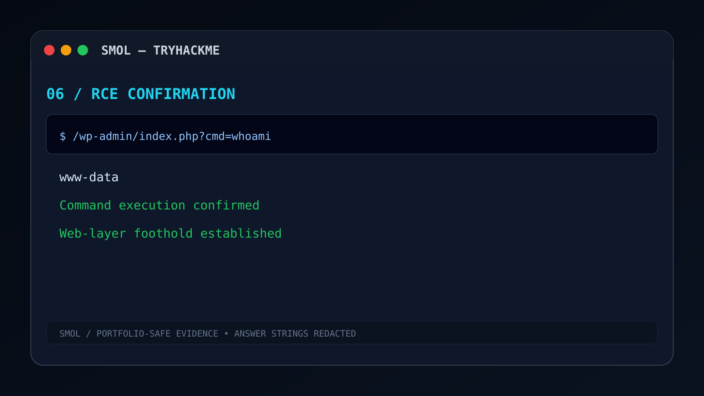

<div class="figure-caption">

**Figure 07.** Validation of operating system command execution through the PHP backdoor.

</div>

---

## Safe Validation Strategy

Before attempting persistence or shells, the assessment executed low-risk commands.

### Validation Commands

```bash id="vkpt0s"
whoami
id
hostname
pwd
uname -a
```

---

## Execution Dashboard

<div class="dashboard-grid">

<div class="metric-card success">

### 👤 Execution Context

Web Server User

</div>

<div class="metric-card success">

### 🐧 Linux Environment

Confirmed

</div>

<div class="metric-card success">

### 📁 Working Directory

Enumerated

</div>

<div class="metric-card success">

### ⚙️ Command Execution

Validated

</div>

</div>

---

## Operating System Enumeration

Once execution was confirmed, environmental reconnaissance collected:

<table><table-section header><table-row header><table-cell header>Information</table-cell><table-cell header>Purpose</table-cell></table-row></table-section><table-row><table-cell>User Context</table-cell><table-cell>Privilege level.</table-cell></table-row><table-row><table-cell>Hostname</table-cell><table-cell>System identification.</table-cell></table-row><table-row><table-cell>Kernel Version</table-cell><table-cell>Privilege escalation planning.</table-cell></table-row><table-row><table-cell>Filesystem Location</table-cell><table-cell>Application layout.</table-cell></table-row><table-row><table-cell>Operating System</table-cell><table-cell>Linux distribution identification.</table-cell></table-row></table>

---

## Why Validate RCE Carefully?

<div class="info-card info">

### Professional Assessment Practice

A penetration test should first verify execution using non-destructive commands before launching payloads.

Benefits include:

* Reduced operational impact.
* Accurate privilege verification.
* Better reporting evidence.
* Controlled exploitation workflow.

</div>

---

## Security Impact Matrix

<div class="risk-grid">

<div class="risk critical">

### 🔴 Critical Impact

Remote Code Execution

</div>

<div class="risk high">

### 🟠 High Impact

Filesystem Access

Credential Harvesting

Post Exploitation

</div>

</div>

---

# 🐚 Phase VII — Interactive Reverse Shell

> *Remote Code Execution was upgraded into a stable Linux shell for post-exploitation.*

---

<div class="phase-banner">

## Establishing Interactive Access

**Objective**

Convert isolated command execution into a fully interactive Linux terminal.

</div>

---

## Figure 08 — Reverse Shell

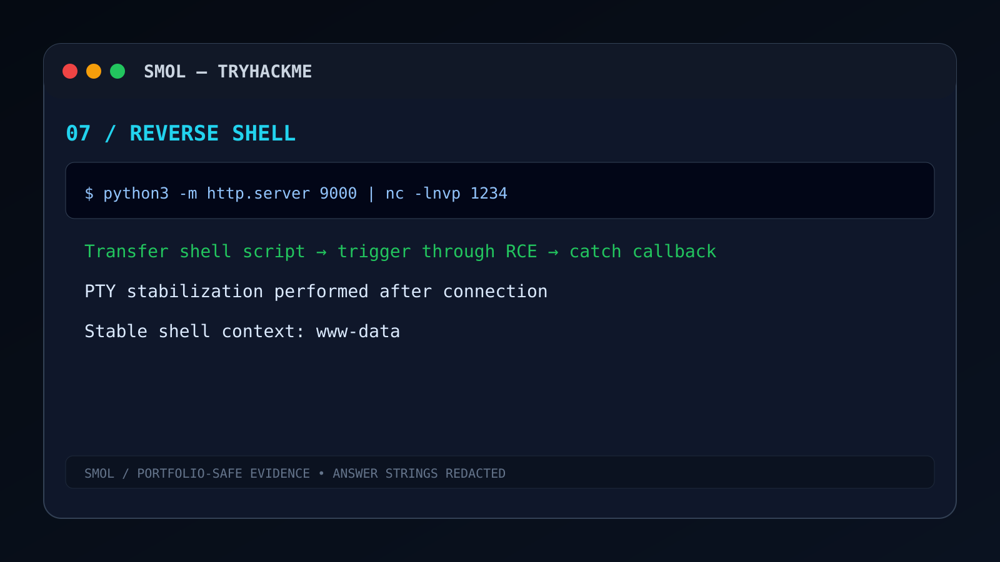

<div class="figure-caption">

**Figure 08.** Interactive reverse shell established from the compromised WordPress server.

</div>

---

## Reverse Shell Workflow

```text id="pndazg"
Attacker Listener
       ▲
       │ TCP Connection
       │
Target Web Server
       │
       ▼
PHP Backdoor
       │
       ▼
Interactive Bash Shell
```

---

## Reverse Shell Dashboard

<div class="dashboard-grid">

<div class="metric-card success">

### 📡 Listener Ready

Netcat

</div>

<div class="metric-card success">

### 🐚 Interactive Shell

Bash Session Established

</div>

<div class="metric-card success">

### 🖥️ Linux Access

TTY Available

</div>

<div class="metric-card success">

### 🔍 Environment Enumeration

Ready

</div>

</div>

---

## Shell Stabilization

Interactive shells require TTY improvements for usability.

### PTY Upgrade

```bash id="ktqagw"
python3 -c 'import pty; pty.spawn("/bin/bash")'
```

### Terminal Improvements

```bash id="h8q91u"
export TERM=xterm
stty rows 40 columns 120
```

---

## Stabilization Benefits

<table><table-section header><table-row header><table-cell header>Improvement</table-cell><table-cell header>Benefit</table-cell></table-row></table-section><table-row><table-cell>Interactive Bash</table-cell><table-cell>Command history.</table-cell></table-row><table-row><table-cell>Arrow Keys</table-cell><table-cell>Improved usability.</table-cell></table-row><table-row><table-cell>Terminal Size</table-cell><table-cell>Interactive applications.</table-cell></table-row><table-row><table-cell>Signal Handling</table-cell><table-cell>Reliable shell behavior.</table-cell></table-row></table>

---

## Initial Linux Enumeration

Immediately after stabilization, the assessment validated the execution context.

### Enumeration Terminal

```bash id="y0i8h5"
whoami
id
hostname
pwd
env
```

---

## Interactive Shell Findings

<div class="info-card success">

### Post-Exploitation Ready

The shell now supports:

* Filesystem traversal.
* Credential harvesting.
* SSH key discovery.
* Database analysis.
* Privilege escalation enumeration.

</div>

---

# Visual Exploitation Gallery

<div class="gallery-grid">

<div>


**Configuration Disclosure**

</div>

<div>


**Plugin Backdoor Analysis**

</div>

<div>


**Remote Code Execution**

</div>

<div>


**Interactive Shell**

</div>

</div>

---

# Exploitation Findings Dashboard

<div class="risk-grid">

<div class="risk critical">

## 🔴 Critical Findings

* Local File Inclusion
* PHP Backdoor
* Remote Code Execution

</div>

<div class="risk high">

## 🟠 High Findings

* Configuration Disclosure
* Authentication Secrets
* Interactive Shell Access

</div>

</div>

---

# Blue Team Recommendations

## Preventing This Attack Chain

<table><table-section header><table-row header><table-cell header>Control</table-cell><table-cell header>Purpose</table-cell></table-row></table-section><table-row><table-cell>Patch Vulnerable Plugins</table-cell><table-cell>Remove LFI attack vector.</table-cell></table-row><table-row><table-cell>Disable Plugin File Editing</table-cell><table-cell>Prevent malicious PHP modifications.</table-cell></table-row><table-row><table-cell>Monitor Plugin Integrity</table-cell><table-cell>Detect unauthorized changes.</table-cell></table-row><table-row><table-cell>Restrict PHP Execution</table-cell><table-cell>Reduce RCE opportunities.</table-cell></table-row><table-row><table-cell>Outbound Network Monitoring</table-cell><table-cell>Detect reverse shells.</table-cell></table-row></table>

---

# Phase Summary

<div class="summary-card">

## Initial Exploitation Complete

* ✅ Local File Inclusion validated.
* ✅ WordPress configuration disclosed.
* ✅ Database authentication architecture identified.
* ✅ Hidden PHP backdoor reverse engineered.
* ✅ Remote Code Execution confirmed.
* ✅ Interactive reverse shell established.
* ✅ Linux post-exploitation begins.

</div>

---

<div class="next-section">

## ► Next Section

The assessment now enters **Credential Harvesting and Lateral Movement**, including database password hashes, SSH key discovery, backup archive analysis, historical credentials, and user pivoting.

### Upcoming Figures

* `09-wp-user-db-redacted.svg`
* `10-diego-crack-redacted.svg`
* `11-ssh-key-redacted.svg`
* `12-backup-transfer.svg`
* `13-backup-crack-redacted.svg`
* `14-xavi-config-redacted.svg`

</div>

---

# 🔐 Phase VIII — Credential Harvesting

> *Initial shell access is only the beginning. The next objective is to discover credentials, authentication material, and trust relationships that enable lateral movement across the Linux environment.*

---

<div class="phase-banner success">

## Post-Exploitation Intelligence Collection

**Objective**

Enumerate sensitive files, database credentials, password hashes, SSH keys, and historical artifacts available after compromising the WordPress server.

</div>

---

## Figure 09 — WordPress Credential Harvesting

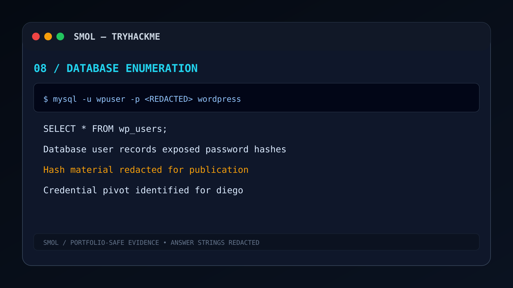

<div class="figure-caption">

**Figure 09.** Enumeration of WordPress authentication records. Usernames are preserved for educational context, while password hashes have been replaced with **`[REDACTED]`**.

</div>

---

# Post-Exploitation Workflow

<div class="exploit-flow">

```text id="q8upgp"
Interactive Shell
        │
        ▼
Filesystem Enumeration
        │
        ▼
WordPress Configuration Review
        │
        ▼
Database Access
        │
        ▼
Credential Harvesting
        │
        ▼
Authentication Material Collected
```

</div>

---

## Credential Discovery Dashboard

<div class="dashboard-grid">

<div class="metric-card success">

### 🗄️ Database Credentials

Recovered from Configuration

</div>

<div class="metric-card warning">

### 👥 WordPress Users

Enumerated

</div>

<div class="metric-card warning">

### 🔑 Password Hashes

Extracted for Offline Analysis

</div>

<div class="metric-card success">

### 📁 Configuration Files

Accessible from Web Context

</div>

</div>

---

# High-Value Credential Sources

<table><table-section header><table-row header><table-cell header>Source</table-cell><table-cell header>Security Impact</table-cell></table-row></table-section><table-row><table-cell>WordPress Database</table-cell><table-cell>Password hashes and user metadata.</table-cell></table-row><table-row><table-cell>`wp-config.php`</table-cell><table-cell>Database authentication material.</table-cell></table-row><table-row><table-cell>User Home Directories</table-cell><table-cell>SSH credentials and notes.</table-cell></table-row><table-row><table-cell>Application Backups</table-cell><table-cell>Historical credentials and configuration.</table-cell></table-row></table>

---

## Filesystem Enumeration Strategy

The compromised web server account was used to enumerate readable resources throughout the Linux filesystem.

### Enumeration Focus

<table><table-section header><table-row header><table-cell header>Directory</table-cell><table-cell header>Purpose</table-cell></table-row></table-section><table-row><table-cell>`/home/`</table-cell><table-cell>User accounts.</table-cell></table-row><table-row><table-cell>`/var/www/`</table-cell><table-cell>Application source code.</table-cell></table-row><table-row><table-cell>`~/.ssh/`</table-cell><table-cell>Authentication material.</table-cell></table-row><table-row><table-cell>Backup Locations</table-cell><table-cell>Archived application data.</table-cell></table-row></table>

---

## Security Observation

<div class="info-card warning">

### Configuration Files Become Credential Stores

A recurring lesson from real-world assessments is that service accounts frequently have read access to sensitive application configuration.

Once configuration files become accessible, attackers often gain authentication material without exploiting additional vulnerabilities.

</div>

---

# 🔓 Phase IX — Password Recovery Methodology

> *Password hashes should be analyzed offline whenever possible to reduce interaction with the target.*

---

<div class="phase-banner">

## Offline Authentication Analysis

**Objective**

Recover reusable authentication credentials without exposing passwords or hashes publicly.

</div>

---

## Figure 10 — Offline Password Recovery

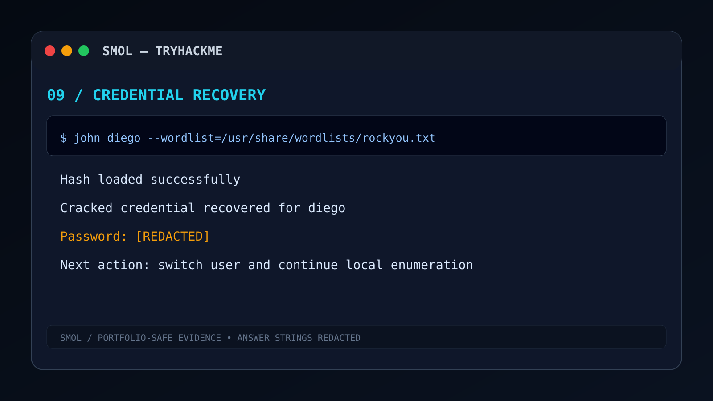

<div class="figure-caption">

**Figure 10.** Offline password recovery workflow demonstrating methodology only. Passwords and hashes have been removed.

</div>

---

## Recovery Workflow

<div class="exploit-flow">

```text id="0vw7f5"
WordPress Password Hash
          │
          ▼
Offline Analysis
          │
          ▼
Dictionary / Rule Testing
          │
          ▼
Recovered Credential
          │
          ▼
Authentication Opportunity
```

</div>

---

## Why Offline Recovery?

<div class="info-card info">

### Professional Assessment Practice

Offline analysis provides several operational advantages:

* No authentication attempts against the target.
* No lockout risk.
* Faster password testing.
* Better reproducibility for reporting.

</div>

---

## Credential Recovery Dashboard

<div class="dashboard-grid">

<div class="metric-card success">

### 🔑 Hashes Extracted

Offline Analysis Ready

</div>

<div class="metric-card success">

### 👤 User Account Recovered

Credential Reuse Opportunity

</div>

<div class="metric-card warning">

### 🔒 Sensitive Values

**[REDACTED]**

</div>

<div class="metric-card warning">

### 📚 Methodology Only

No Passwords Published

</div>

</div>

---

## Security Lessons

<table><table-section header><table-row header><table-cell header>Weak Practice</table-cell><table-cell header>Risk</table-cell></table-row></table-section><table-row><table-cell>Password Reuse</table-cell><table-cell>Lateral movement.</table-cell></table-row><table-row><table-cell>Weak Password Policy</table-cell><table-cell>Offline recovery succeeds.</table-cell></table-row><table-row><table-cell>Shared Credentials</table-cell><table-cell>Multiple services compromised.</table-cell></table-row></table>

---

## Blue Team Recommendations

* Enforce strong passwords.
* Require MFA for administrators.
* Rotate compromised credentials.
* Monitor unusual database access.
* Audit password reuse.

---

# 🔑 Phase X — SSH Lateral Movement

> *Recovered authentication material enables movement beyond the compromised web server process.*

---

<div class="phase-banner success">

## Pivoting Between Linux Users

**Objective**

Authenticate into additional Linux accounts using legitimately recovered credentials.

</div>

---

## Figure 11 — SSH Key Discovery

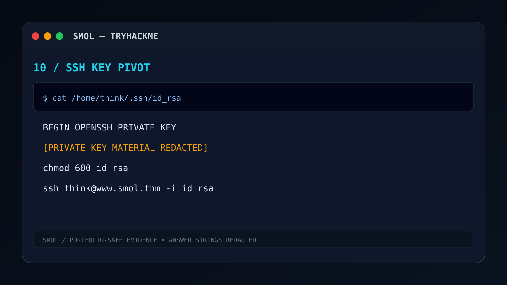

<div class="figure-caption">

**Figure 11.** Discovery of SSH authentication material. Private key contents have been replaced with **`[REDACTED]`**.

</div>

---

## Lateral Movement Timeline

<div class="timeline">

<div class="timeline-item">

### Step 01

Discover User Home Directory

</div>

<div class="timeline-item">

### Step 02

Identify SSH Authentication Material

</div>

<div class="timeline-item">

### Step 03

Validate File Permissions

</div>

<div class="timeline-item">

### Step 04

Authenticate Through SSH

</div>

<div class="timeline-item">

### Step 05

Gain Stable User Shell

</div>

</div>

---

## SSH Enumeration Dashboard

<div class="dashboard-grid">

<div class="metric-card success">

### 📂 `.ssh/`

Authentication Directory

</div>

<div class="metric-card warning">

### 🔑 Private Key

Recovered

**[REDACTED]**

</div>

<div class="metric-card success">

### 👤 SSH User

Pivot Successful

</div>

<div class="metric-card success">

### 💻 Stable Shell

Interactive SSH Session

</div>

</div>

---

## Authentication Material Reviewed

<table><table-section header><table-row header><table-cell header>Artifact</table-cell><table-cell header>Purpose</table-cell></table-row></table-section><table-row><table-cell>`id_rsa`</table-cell><table-cell>Private authentication key.</table-cell></table-row><table-row><table-cell>`authorized_keys`</table-cell><table-cell>Allowed authentication keys.</table-cell></table-row><table-row><table-cell>`known_hosts`</table-cell><table-cell>Historical SSH connections.</table-cell></table-row><table-row><table-cell>`config`</table-cell><table-cell>SSH configuration.</table-cell></table-row></table>

---

## Security Observation

<div class="info-card warning">

### SSH Keys Are Credentials

SSH private keys should be treated with the same sensitivity as passwords.

Improper filesystem permissions allow attackers to authenticate without guessing credentials.

</div>

---

## Detection Opportunities

<table><table-section header><table-row header><table-cell header>Event</table-cell><table-cell header>Detection Strategy</table-cell></table-row></table-section><table-row><table-cell>New SSH Session</table-cell><table-cell>Authentication logs.</table-cell></table-row><table-row><table-cell>Unexpected SSH Key Usage</table-cell><table-cell>Key fingerprint monitoring.</table-cell></table-row><table-row><table-cell>Web Server User Reading `.ssh`</table-cell><table-cell>File integrity monitoring.</table-cell></table-row></table>

---

# 📦 Phase XI — Backup Archive Analysis

> *Historical backups frequently preserve secrets long after production systems have changed.*

---

<div class="phase-banner warning">

## Historical Artifact Investigation

**Objective**

Analyze archived WordPress backups for historical credentials, configuration files, and authentication artifacts.

</div>

---

## Figure 12 — Backup Archive Discovery

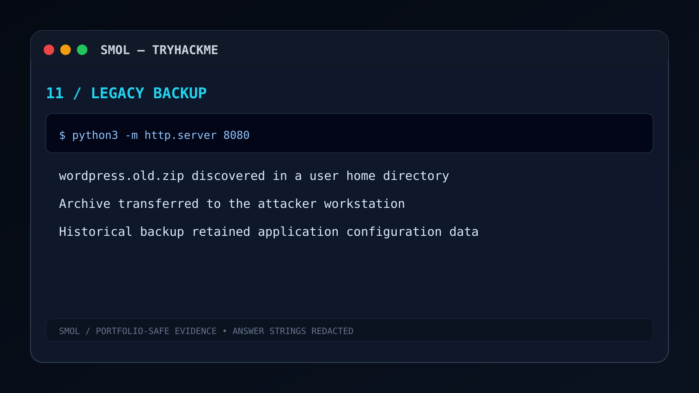

<div class="figure-caption">

**Figure 12.** Discovery of a password-protected backup archive during filesystem enumeration.

</div>

---

## Why Backups Matter

Backups often contain:

* Old credentials.
* Configuration files.
* Environment variables.
* Database exports.
* Archived application code.

---

## Backup Enumeration Dashboard

<div class="dashboard-grid">

<div class="metric-card success">

### 📦 Backup Archive

Identified

</div>

<div class="metric-card warning">

### 🔒 Password Protected

Offline Analysis Required

</div>

<div class="metric-card success">

### 📁 Historical Configuration

Recovered

</div>

<div class="metric-card warning">

### 🗄️ Archived Secrets

Present

</div>

</div>

---

## Archive Analysis Workflow

```text id="2okdw8"
Filesystem Enumeration
        │
        ▼
Backup Archive Located
        │
        ▼
Archive Inspection
        │
        ▼
Offline Password Recovery
        │
        ▼
Historical Files Extracted
```

---

## Figure 13 — Archive Password Recovery

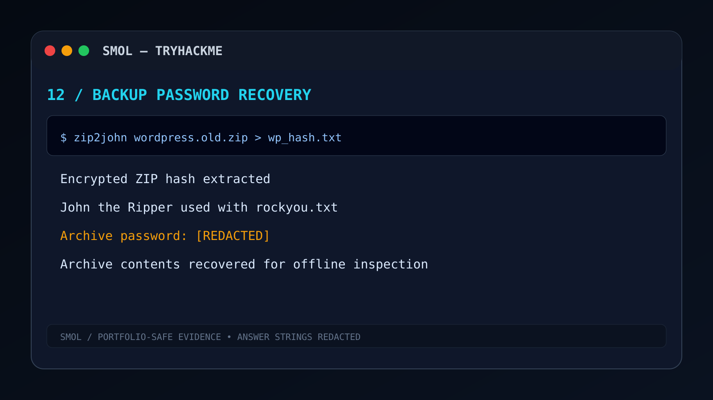

<div class="figure-caption">

**Figure 13.** Offline recovery of archive access credentials. Password values have been removed.

</div>

---

## Security Impact

<div class="info-card danger">

### Historical Secrets Expand the Attack Surface

Archived credentials frequently remain valid.

Backups therefore become:

* Credential repositories.
* Configuration repositories.
* Historical attack intelligence.

</div>

---

# 👥 Phase XII — Additional User Discovery

> *Recovered historical configuration revealed additional trust relationships within the Linux environment.*

---

<div class="phase-banner">

## Historical Credential Discovery

**Objective**

Review extracted configuration for additional users, authentication paths, and privilege relationships.

</div>

---

## Figure 14 — Additional Credential Discovery

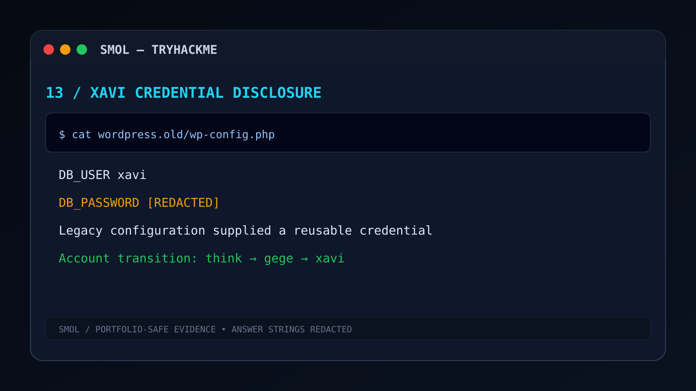

<div class="figure-caption">

**Figure 14.** Historical configuration analysis revealing additional authentication information while removing all sensitive values.

</div>

---

## User Pivot Dashboard

<div class="dashboard-grid">

<div class="metric-card success">

### 👥 Additional Linux User

Discovered

</div>

<div class="metric-card success">

### 🔑 Historical Credentials

Recovered

</div>

<div class="metric-card warning">

### 🗂️ Legacy Configuration

Exposed

</div>

<div class="metric-card success">

### 🔄 Lateral Movement

Expanded User Access

</div>

</div>

---

## Trust Relationship Analysis

<table><table-section header><table-row header><table-cell header>Discovery</table-cell><table-cell header>Security Value</table-cell></table-row></table-section><table-row><table-cell>User Home Directories</table-cell><table-cell>Privilege mapping.</table-cell></table-row><table-row><table-cell>Historical Configuration</table-cell><table-cell>Authentication reuse.</table-cell></table-row><table-row><table-cell>SSH Material</table-cell><table-cell>User pivoting.</table-cell></table-row><table-row><table-cell>Archive Metadata</table-cell><table-cell>Account relationships.</table-cell></table-row></table>

---

## Credential Reuse Chain

<div class="exploit-flow">

```text id="hxp5sd"
WordPress Credentials
        │
        ▼
Linux User Authentication
        │
        ▼
SSH Access
        │
        ▼
Historical Backup
        │
        ▼
Additional Credentials
        │
        ▼
Privilege Escalation Candidate
```

</div>

---

# Visual Gallery — Post Exploitation

<div class="gallery-grid">

<div>


**Database Enumeration**

</div>

<div>


**Password Recovery Workflow**

</div>

<div>


**SSH Authentication Material**

</div>

<div>


**Backup Discovery**

</div>

<div>


**Archive Password Recovery**

</div>

<div>


**Historical Configuration Review**

</div>

</div>

---

# Credential Harvesting Findings

<div class="risk-grid">

<div class="risk critical">

## 🔴 Critical

Database Authentication Material

SSH Credentials

Credential Reuse

</div>

<div class="risk high">

## 🟠 High

Password Hash Exposure

Backup Secrets

Historical Configuration

</div>

</div>

---

# Blue Team Recommendations

## Identity Security

<table><table-section header><table-row header><table-cell header>Recommendation</table-cell><table-cell header>Purpose</table-cell></table-row></table-section><table-row><table-cell>Unique Passwords</table-cell><table-cell>Prevent credential reuse.</table-cell></table-row><table-row><table-cell>MFA for Administrators</table-cell><table-cell>Protect WordPress administration.</table-cell></table-row><table-row><table-cell>Rotate SSH Keys</table-cell><table-cell>Invalidate exposed authentication material.</table-cell></table-row><table-row><table-cell>Protect Home Directory Permissions</table-cell><table-cell>Prevent SSH key disclosure.</table-cell></table-row><table-row><table-cell>Audit Backup Storage</table-cell><table-cell>Remove archived secrets.</table-cell></table-row></table>

---

# Phase Summary

<div class="summary-card">

## Credential Harvesting Completed

* ✅ Database credentials analyzed.
* ✅ Password hashes recovered.
* ✅ Offline recovery methodology demonstrated.
* ✅ SSH authentication material discovered.
* ✅ User pivot completed through SSH.
* ✅ Backup archive analyzed.
* ✅ Historical credentials recovered.
* ✅ Privilege escalation path prepared.

</div>

---

---

# 👑 Phase XIII — Linux Privilege Escalation

> *The final objective of the engagement was to escalate from an authenticated Linux user to unrestricted administrative control of the operating system.*

---

<div class="phase-banner danger">

## Root Compromise

**Objective**

Identify local privilege escalation opportunities through sudo configuration and obtain full administrative access.

</div>

---

## Figure 15 — Root Privilege Escalation

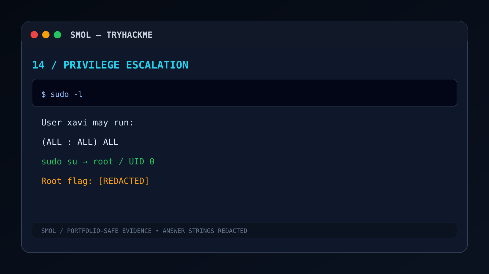

<div class="figure-caption">

**Figure 15.** Successful privilege escalation to the root account after reviewing local privilege delegation. Sensitive terminal output has been removed.

</div>

---

# Privilege Escalation Kill Chain

<div class="exploit-flow">

```text
Interactive Linux User
         │
         ▼
 Local Enumeration
         │
         ▼
 sudo Permission Review
         │
         ▼
 Excessive Privileges Identified
         │
         ▼
 Privileged Binary Execution
         │
         ▼
 ROOT SHELL
```

</div>

---

## Privilege Enumeration Dashboard

<div class="dashboard-grid">

<div class="metric-card success">

### 👤 Current User

Authenticated Linux User

</div>

<div class="metric-card warning">

### ⚙️ sudo Permissions

Enumerated

</div>

<div class="metric-card danger">

### 👑 Privileged Binary

Abusable

</div>

<div class="metric-card danger">

### 🔓 Root Access

Achieved

</div>

</div>

---

## Local Enumeration Strategy

Before escalation, the assessment reviewed common privilege escalation vectors.

<table><table-section header><table-row header><table-cell header>Enumeration Area</table-cell><table-cell header>Purpose</table-cell></table-row></table-section><table-row><table-cell>sudo Privileges</table-cell><table-cell>Identify delegated administrative permissions.</table-cell></table-row><table-row><table-cell>SUID Binaries</table-cell><table-cell>Privilege escalation opportunities.</table-cell></table-row><table-row><table-cell>Linux Capabilities</table-cell><table-cell>Additional execution privileges.</table-cell></table-row><table-row><table-cell>User Groups</table-cell><table-cell>Privilege inheritance.</table-cell></table-row><table-row><table-cell>Writable Files</table-cell><table-cell>Potential privilege abuse.</table-cell></table-row></table>

---

## Excessive sudo Permissions

<div class="info-card danger">

### Critical Misconfiguration

The compromised account possessed **excessive sudo privileges** that violated the Principle of Least Privilege.

This allowed privileged execution without requiring exploitation of the Linux kernel.

</div>

---

## Security Impact

<table><table-section header><table-row header><table-cell header>Capability After Escalation</table-cell><table-cell header>Impact</table-cell></table-row></table-section><table-row><table-cell>Read Protected Files</table-cell><table-cell>Full filesystem disclosure.</table-cell></table-row><table-row><table-cell>Modify System Configuration</table-cell><table-cell>Complete persistence capability.</table-cell></table-row><table-row><table-cell>Create Administrative Users</table-cell><table-cell>Privilege persistence.</table-cell></table-row><table-row><table-cell>Access SSH Configuration</table-cell><table-cell>Credential compromise.</table-cell></table-row><table-row><table-cell>Control Running Services</table-cell><table-cell>System-wide compromise.</table-cell></table-row></table>

---

## Root Verification

<div class="terminal-card">

### Verification

```bash
whoami
id
hostnamectl
```

```text
root
uid=0(root)
```

</div>

---

## Attack Chain Completed

<div class="summary-card">

### Complete Compromise Achieved

* Initial Access
* WordPress Enumeration
* LFI Exploitation
* Configuration Disclosure
* Remote Code Execution
* Reverse Shell
* Credential Harvesting
* SSH Pivot
* Backup Analysis
* Root Privilege Escalation

</div>

---

# 📊 Executive Findings Dashboard

## Security Findings Overview

<div class="findings-grid">

<div class="finding critical">

### 🔴 F-01

Local File Inclusion

**High Severity**

WordPress plugin allowed arbitrary file disclosure.

</div>

<div class="finding critical">

### 🔴 F-02

Configuration Disclosure

**High Severity**

Sensitive WordPress configuration exposed.

</div>

<div class="finding critical">

### 🔴 F-03

Hidden PHP Backdoor

**Critical Severity**

Server-side command execution functionality discovered.

</div>

<div class="finding critical">

### 🔴 F-04

Remote Code Execution

**Critical Severity**

Operating system commands executed remotely.

</div>

<div class="finding high">

### 🟠 F-05

Credential Harvesting

Password hashes and authentication material recovered.

</div>

<div class="finding high">

### 🟠 F-06

SSH Key Exposure

Authentication material accessible from filesystem.

</div>

<div class="finding high">

### 🟠 F-07

Backup Credential Disclosure

Historical backup exposed sensitive configuration.

</div>

<div class="finding critical">

### 🔴 F-08

Privilege Escalation

Misconfigured sudo permissions resulted in root access.

</div>

</div>

---

# CVSS-Style Risk Summary

| Finding                  | Severity    | Business Impact                   |
| ------------------------ | ----------- | --------------------------------- |
| Local File Inclusion     | 🔴 High     | Sensitive file disclosure.        |
| Configuration Disclosure | 🔴 High     | Database credential compromise.   |
| Hidden PHP Backdoor      | 🔴 Critical | Arbitrary command execution.      |
| Remote Code Execution    | 🔴 Critical | Operating system compromise.      |
| Password Hash Exposure   | 🟠 High     | Offline password recovery.        |
| SSH Key Exposure         | 🟠 High     | User authentication compromise.   |
| Backup Archive Secrets   | 🟠 High     | Historical credential disclosure. |
| sudo Misconfiguration    | 🔴 Critical | Full administrative compromise.   |

---

# MITRE ATT&CK Coverage

<div class="mitre-section">

## ATT&CK Matrix

| Tactic               | Technique Demonstrated               |
| -------------------- | ------------------------------------ |
| Reconnaissance       | Active Scanning                      |
| Initial Access       | Exploit Public-Facing Application    |
| Execution            | Command and Scripting Interpreter    |
| Persistence          | Server-Side Script                   |
| Credential Access    | Credentials from Configuration Files |
| Discovery            | File and Directory Discovery         |
| Lateral Movement     | SSH                                  |
| Collection           | Archive Collected Data               |
| Privilege Escalation | Abuse Elevation Control Mechanism    |
| Impact               | Full System Compromise               |

</div>

---

## ATT&CK Attack Timeline

<div class="timeline">

<div class="timeline-item">

### Reconnaissance

Service Discovery

Technology Fingerprinting

</div>

<div class="timeline-item">

### Initial Access

Local File Inclusion

</div>

<div class="timeline-item">

### Execution

Remote Command Execution

</div>

<div class="timeline-item">

### Credential Access

Database & SSH Material

</div>

<div class="timeline-item">

### Discovery

Filesystem Enumeration

</div>

<div class="timeline-item">

### Lateral Movement

SSH Authentication

</div>

<div class="timeline-item">

### Privilege Escalation

sudo Misconfiguration

</div>

<div class="timeline-item">

### Impact

Root Access

</div>

</div>

---

# 🛡️ Blue Team Recommendations

## WordPress Hardening

<div class="recommendation-grid">

<div class="recommendation">

### 🔒 Plugin Security

* Remove unused plugins.
* Patch vulnerable plugins immediately.
* Enable plugin integrity monitoring.
* Disable plugin editor in production.

</div>

<div class="recommendation">

### 📂 Configuration Protection

* Restrict access to `wp-config.php`.
* Prevent directory traversal.
* Limit filesystem permissions.
* Store secrets securely.

</div>

</div>

---

## Linux Hardening

<div class="recommendation-grid">

<div class="recommendation">

### 👤 Identity Security

* Rotate compromised passwords.
* Enforce unique credentials.
* Enable MFA for administrators.
* Protect SSH keys.

</div>

<div class="recommendation">

### ⚙️ Privilege Management

* Review sudoers configuration.
* Remove unnecessary sudo rights.
* Audit privileged binaries.
* Apply Principle of Least Privilege.

</div>

</div>

---

## Monitoring Recommendations

| Detection Area         | Monitoring Strategy                |
| ---------------------- | ---------------------------------- |
| Plugin Integrity       | File Integrity Monitoring          |
| PHP Execution          | Monitor dangerous PHP functions    |
| Reverse Shell Activity | Outbound network monitoring        |
| SSH Authentication     | Login anomaly detection            |
| sudo Usage             | Audit privileged command execution |
| Backup Access          | Monitor archive reads              |

---

# Security Improvement Roadmap

<div class="roadmap-grid">

<div class="roadmap-card">

### Immediate Actions

* Patch vulnerable plugin.
* Remove malicious plugin code.
* Rotate exposed credentials.
* Review backup permissions.

</div>

<div class="roadmap-card">

### Short-Term Hardening

* Restrict XML-RPC if unnecessary.
* Enable WordPress MFA.
* Harden filesystem permissions.
* Remove archived secrets.

</div>

<div class="roadmap-card">

### Long-Term Improvements

* Continuous vulnerability scanning.
* Configuration management.
* Secret management platform.
* Centralized logging and SIEM.

</div>

</div>

---

# Skills Demonstrated

## Offensive Security

<div class="skills-grid">

<div class="skill-box">

### 🌐 Reconnaissance

Nmap

Service Enumeration

</div>

<div class="skill-box">

### 🕸️ Web Security

Gobuster

WPScan

WordPress Enumeration

</div>

<div class="skill-box">

### 💥 Exploitation

Local File Inclusion

Remote Code Execution

PHP Analysis

</div>

<div class="skill-box">

### 🐚 Linux

Reverse Shell

TTY Stabilization

Post Exploitation

</div>

<div class="skill-box">

### 🔐 Credential Access

Database Enumeration

SSH Keys

Offline Password Recovery

</div>

<div class="skill-box">

### 👑 Privilege Escalation

sudo Enumeration

Linux PrivEsc

Root Verification

</div>

</div>

---

## Defensive Security

<div class="skills-grid">

<div class="skill-box">

### 🛡️ WordPress Hardening

Plugin Security

Configuration Protection

</div>

<div class="skill-box">

### 🔍 Detection Engineering

Reverse Shell Detection

Plugin Monitoring

SSH Monitoring

</div>

<div class="skill-box">

### 📊 Threat Mapping

MITRE ATT&CK

OWASP Awareness

</div>

<div class="skill-box">

### 📑 Security Reporting

Penetration Testing Documentation

Executive Findings

Remediation Planning

</div>

</div>

---

# Learning Outcomes

After completing this assessment, the following concepts were reinforced.

## Web Application Security

* WordPress reconnaissance methodology.
* Plugin attack surface analysis.
* Local File Inclusion exploitation.
* Configuration disclosure risks.

## Linux Security

* Interactive shell stabilization.
* Filesystem enumeration.
* Credential harvesting.
* SSH authentication review.
* Backup security assessment.

## Privilege Escalation

* sudo privilege enumeration.
* Least Privilege violations.
* Administrative access validation.
* Security impact assessment.

---

# Visual Evidence Gallery

<div class="gallery-grid">

<div>


**Network Reconnaissance**

</div>

<div>


**Web Enumeration**

</div>

<div>


**WordPress Enumeration**

</div>

<div>


**Configuration Disclosure**

</div>

<div>


**PHP Backdoor Analysis**

</div>

<div>


**Remote Code Execution**

</div>

<div>


**Reverse Shell**

</div>

<div>


**Credential Harvesting**

</div>

<div>


**Password Recovery Workflow**

</div>

<div>


**SSH Pivot**

</div>

<div>


**Backup Discovery**

</div>

<div>


**Archive Password Recovery**

</div>

<div>


**Historical Credential Discovery**

</div>

<div>


**Root Privilege Escalation**

</div>

</div>

---

# Lessons Learned

<div class="lessons-grid">

<div class="lesson-card">

## 🔍 Offensive Takeaways

A seemingly small WordPress vulnerability became a complete Linux compromise through chained weaknesses.

</div>

<div class="lesson-card">

## 🔐 Identity Takeaways

Credential reuse and poor secret storage dramatically increase attacker capability after initial compromise.

</div>

<div class="lesson-card">

## 🛡️ Defensive Takeaways

Least Privilege, plugin integrity monitoring, and secure backup management would have interrupted the attack chain.

</div>

<div class="lesson-card">

## 📑 Reporting Takeaways

Professional penetration testing reports should document methodology, evidence, impact, and remediation—not simply exploit steps.

</div>

</div>

---

# References

## Security Frameworks

* MITRE ATT&CK Framework
* OWASP Web Security Testing Guide
* WordPress Security Documentation
* GTFOBins (Privilege Escalation Reference)

---

## Tools Used

| Tool            | Purpose                               |
| --------------- | ------------------------------------- |
| Nmap            | Network Reconnaissance                |
| Gobuster        | Directory Enumeration                 |
| WPScan          | WordPress Enumeration                 |
| Netcat          | Reverse Shell Listener                |
| Python          | TTY Stabilization                     |
| SSH             | Lateral Movement                      |
| zipinfo / unzip | Backup Analysis                       |
| John / Hashcat  | Offline Password Recovery Methodology |

---

# Repository Contents

<div class="repo-grid">

<div class="repo-card">

### 📘 Documentation

Complete technical penetration testing report.

`Documentation/Documentation.md`

</div>

<div class="repo-card">

### 🌐 GitHub Pages

Premium cybersecurity portfolio landing page.

`docs/index.md`

</div>

<div class="repo-card">

### 📝 Notes

Quick reference commands and learning notes.

`Resources/notes.md`

</div>

<div class="repo-card">

### 🎨 Assets

SVG illustrations and evidence gallery.

`docs/assets/img/`

</div>

</div>

---

# About This Portfolio Project

<div class="portfolio-card">

## Professional Cybersecurity Portfolio

This project demonstrates a complete end-to-end penetration testing engagement within a controlled TryHackMe environment.

The documentation has been rewritten to resemble an **enterprise Red Team technical assessment** rather than a standard Capture The Flag walkthrough.

### Portfolio Highlights

* Professional penetration testing methodology.
* Enterprise-style documentation.
* GitHub Pages compatible.
* Recruiter-friendly presentation.
* Original diagrams and SVG figures.
* Flags and sensitive values fully redacted.

</div>

---

# Author

<div class="author-section">

## Anurag Revankar

Cybersecurity Researcher • Penetration Tester • Security Automation Enthusiast

Specializing in:

* Offensive Security
* Active Directory
* Web Application Security
* AI-powered SOC Engineering
* Cloud Security
* Security Automation
* Capture The Flag Documentation

**GitHub Portfolio**

`anurag-rvnkr1`

</div>

---

# Portfolio Footer

<div class="footer-banner">

# Smol — TryHackMe Walkthrough

### Professional Red Team Case Study • WordPress Security Assessment

**Capture The Flag Documentation • GitHub Pages Portfolio • Cybersecurity Learning Resource**

⭐ **Designed as a premium cybersecurity portfolio project for recruiters and hiring managers.**

</div>
